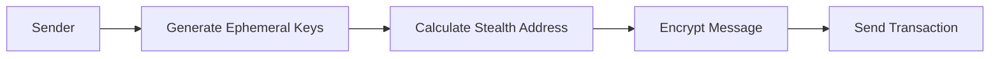
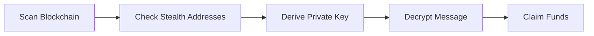

# GiftSecure: Private Value Transfer with Encrypted Messaging

## Overview
GiftSecure is a decentralized application (dApp) enabling users to send tokens alongside private, encrypted messages. This solution leverages AltLayer's rollup technology and Babylon's Bitcoin staking protocol to achieve privacy, fast transaction finality, and enhanced security.

## Problem Statement
Blockchain transactions are inherently public, making it difficult to maintain privacy when transferring funds or messages. Users who want to send tokens or private messages face challenges due to address reuse and traceability, which can compromise their privacy.

## Solution: Stealth Address Protocol
GiftSecure implements a stealth address protocol that ensures transaction privacy by generating unique, one-time addresses for each transfer. This makes it impossible to link transactions to specific recipients on a public blockchain.

1 Liner -> GiftSecure combines the scalability and flexibility of AltLayer's rollup infrastructure with the robust security of Babylon’s Bitcoin staking protocol to provide a private, secure, and efficient value transfer and messaging solution.

## How it works architecture 


## Security

By combining Babylon's Bitcoin staking capabilities with AltLayer's rollup infrastructure, our social application can achieve a high level of security, fast transaction finality, and decentralized verification, all while leveraging Bitcoin's established network.

### Key Components
1. **Key Pairs**
   - Users generate two key pairs:
     - Viewing key pair (for decrypting messages)
     - Spending key pair (for claiming funds)

   Example implementation:
   ```typescript
   export async function registerKeys(keys: StealthKeys) {
     const provider = new ethers.BrowserProvider(window.ethereum);
     const signer = await provider.getSigner();
     const contract = new ethers.Contract(REGISTRY_CONTRACT_ADDRESS, KEY_REGISTRY_ABI, signer);

     const parsePublicKey = (publicKey: string) => {
       const hexString = publicKey.startsWith('0x') ? publicKey.slice(2) : publicKey;
       const prefix = parseInt(hexString.slice(0, 2), 16);
       const key = BigInt(`0x${hexString.slice(2)}`);
       return { prefix, key };
     };

     const { prefix: spendingPubKeyPrefix, key: spendingPubKey } = parsePublicKey(keys.spendingPublicKey);
     const { prefix: viewingPubKeyPrefix, key: viewingPubKey } = parsePublicKey(keys.viewingPublicKey);

     const tx = await contract.setStealthMetaAddress(
       spendingPubKeyPrefix,
       spendingPubKey,
       viewingPubKeyPrefix,
       viewingPubKey
     );
   }
   ```

2. **Stealth Address Generation**
   - A sender generates an ephemeral key pair and combines it with the recipient’s public keys to create a unique stealth address for the transaction.

   Example:
   ```typescript
   const ephemeralPublicKey = bytes.slice(0, 33);
   const encryptedMessage = bytes.slice(33);
   const ephemeralPoint = secp.Point.fromHex(Buffer.from(ephemeralPublicKey).toString('hex'));
   const sharedSecret = secp.getSharedSecret(BigInt(viewingPrivateKey).toString(16), ephemeralPoint);
   ```

3. **Fund Claiming**
   - Recipients scan the blockchain for relevant transactions and use their private keys to determine if the stealth address belongs to them. If so, they claim the funds using the derived private key.

   Example:
   ```typescript
   const stealthPrivateKey = calculateStealthPrivateKey(event.ephemeralPubKey, viewingPrivateKey, spendingPrivateKey);
   const stealthWallet = new ethers.Wallet(`0x${stealthPrivateKey}`, new ethers.JsonRpcProvider('https://sepolia.gateway.tenderly.co'));
   ```

## Privacy Features
1. **Address Privacy**
   - Each transaction uses a unique stealth address, eliminating any on-chain link between the recipient’s main address and the stealth address.

2. **Message Privacy**
   - Messages are encrypted using the recipient’s viewing key, ensuring only the recipient can decrypt and read the message.

## AltLayer Integration
AltLayer’s rollup infrastructure enables GiftSecure to:
- **Scale effectively**, handling high transaction volumes.
- Ensure **decentralized verification** for enhanced security.
- Support **flexible rollup configurations**, allowing optimal infrastructure choices.

## Babylon Integration
GiftSecure leverages Babylon’s Bitcoin staking protocol for:
- **Enhanced security** by staking BTC, benefiting from Bitcoin’s robust security model.
- **Bitcoin Timestamping**, anchoring transactions to Bitcoin’s blockchain to reduce long-range attack risks and provide an added layer of trust.

## Technical Workflow
### Sending Funds & Messages

### Claiming Funds


## Security Considerations
- **Key Management**: Users must securely store viewing and spending keys. These keys should never be shared.
- **Transaction Privacy**: Unique stealth addresses for each transaction ensure no on-chain link exists between the main and stealth addresses. Note that transaction metadata (e.g., amounts, timestamps) remains visible on-chain.

## Getting Started
1. **Setup Keys**
   ```typescript
   await generateStealthKeys(signature);
   await registerKeys(keys);
   ```
2. **Send Private Transaction**
   ```typescript
   const { stealthAddress, ephemeralPublicKey } = await calculateStealthAddress(recipientKeys);
   await contract.sendEth(stealthAddress, ephemeralPublicKey, encryptedMessage);
   ```
3. **Monitor & Claim**
   ```typescript
   const isOurs = await checkIfStealthIsOurs(event);
   if (isOurs) {
     await checkAndClaimFunds(event);
   }
   ```

## Development Setup
1. **Clone the repository**
2. **Install dependencies**: `npm install`
3. **Configure the network** in `.env`
4. **Run the development server**: `npm run dev`
